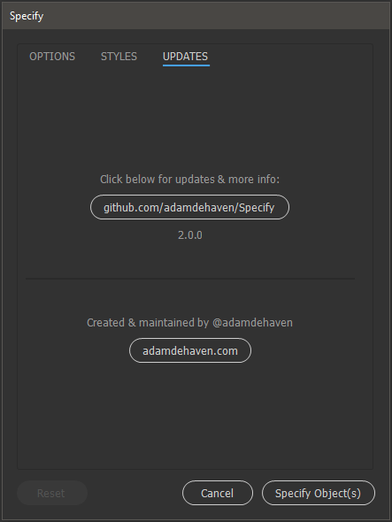

# Specify: A dimensioning script for Adobe Illustrator

Adobe Illustrator script and extension to automate specifying dimension measurements (and adding dimension lines) of single or multiple objects, and specifying the dimensions between two objects.


## Installation

1. [Download a copy of the latest release](https://github.com/adamdehaven/Specify/archive/master.zip).
2. Extract the contents of the `.zip` file to one of the recommended file paths shown below (depending on your OS) in order to allow running the script from Illustrator's `File > Scripts` menu.

    ``` sh
    # Windows
    C:\Program Files\Adobe\Adobe Illustrator [VERSION]\Presets\en_US\Scripts

    # Mac
    Applications > Adobe Illustrator [VERSION] > Presets > en_US > Scripts
    ```

Alternatively, you may save the folder and all of its contents at the location of your choosing.

Regardless of where you save the files, you **must** save the entire `Specify` folder and all of its contents at the same location, without manipulating the structure of the folder.

## Usage

To run the script, first select one or more objects in your open Illustrator document. You must have at least one object selected via Illustrator's Selection Tool <kbd>V</kbd> or Direct Selection Tool <kbd>A</kbd>.

Assuming you saved the script as [described above](#installation), in Illustrator's menu, go to `File > Scripts > Specify > Specify` ("Specify" appears twice because you have to call the script file inside the Specify directory).

If you chose an alternate location to save the Specify folder, you can run by going to `File > Scripts > Other Script...`, and then selecting the `Specify.jsx` file.

### Options and Styles

When the script initializes, you will be presented with a dialog that allows you to choose which dimension(s) of your object(s) you would like to specify. The dialog also allows for the customization of several options. Any changes to the settings defined in the Specify Dialog (including both the [Options Panel](#options-panel) and the [Styles Panel](#styles-panel)) will persist until you close the Adobe Illustrator application, even if you run the script in multiple documents.

After configuring your desired settings, make sure to select which dimension(s) to dimension, and then simply click the "Specify Object(s)" button at the bottom right of the dialog. Specify will quickly output all selected dimensions onto a new **SPEC** layer, and then lock the layer to prevent accidental edits.

### SPEC Layer

You are free to unlock the **SPEC** layer and edit as needed. You may change the color of individual dimension labels, adjust the placement of dimension groups, or even remove dimensions you no longer need.

If you make a mistake, no problem! Simply select the desired objects and run the script again.

## Options Panel


The Options Panel allows the user to select the side(s) of the object(s) to dimension, whether to dimension the object itself or between objects, and the scale of the artwork.

### Dimensions

The options panel allows you to first choose which dimension(s) of your Illustrator object you would like to specify. You may choose top, right, bottom, left, or any combination of sides.

### Multiple Objects

If exactly two objects are selected on your artboard, you will be given the option to dimension between the two objects, instead of their individual sides. When checked, this option will specify the selected dimension(s) between the two chosen objects.

### Scale

You may define a custom scale for your artwork, which will apply a multiplier to the displayed units label.

For example, if you are designing an engineering drawing at 1/4 scale (or 1:4), you simply choose this ratio from the **Scale** dropdown menu, and then optionally enable the checkbox for [Custom Units Text](#custom-units-text) on the Styles Panel that corresponds to the unit labels you would like to output. In this example, choosing '1/4' will indicate the artwork is drawn at one-fourth scale, resulting in dimension values that are 4 times their drawn dimensions.

## Styles Panel


The Styles Panel allows the user to completely customize the label styles and the line styles for all dimensions.

### Include Units in Label

When checked, inserts the units in the label alongside the dimension measurement.

The script automatically dimensions objects based on the Document's default units. To dimension in different units (i.e. Inches, Centimeters, etc.), first, select show Rulers via `View > Rulers > Show Rulers` ( <kbd>⌘Cmd</kbd> + <kbd>R</kbd> on Mac, <kbd>Ctrl</kbd> + <kbd>R</kbd> on PC ).

Next, right-click on the Ruler, and select your desired units. Otherwise, the script will use the Document's selected units by default.

### Custom Units Text

When checked, allows the user to customize the text of the units label. For example, displaying the abbreviation for feet, "ft" instead of the ruler measurement unit.

### Decimals

Set the desired number of decimal places to display after the decimal point in the label dimensions.

### Font Size

Set the desired font size for the dimension label(s). If the value is less than one (e.g. 0.25) you must include a leading zero before the decimal point.

### Color

Click to select the color for the dimension label(s).

### Gap

Set the size of the desired gap between the dimension label(s) and the object.

### Stroke Width

Set the desired stroke width of the dimension line.

### Head & Tail Length

Set the desired length of the line at both ends of the dimension line.

## Updates Panel



The Updates Panel provides the current script version information, along with references to the GitHub code repository, and author information.

Be sure to star and subscribe [on GitHub](https://github.com/adamdehaven/specify) in order to stay up-to-date on future releases.

## Reset

At the bottom left of the Specify dialog is a Reset button that restores all defaults in both the Options Panel and the Styles panel.

## Support

Do you have questions? Would you like to contribute? Something else? Feel free to [open an issue on GitHub](https://github.com/adamdehaven/Specify/issues).

Not into looking at code? No worries. Reach out on Twitter [@adamdehaven](https://twitter.com/adamdehaven).

## Examples


